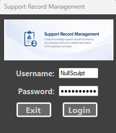
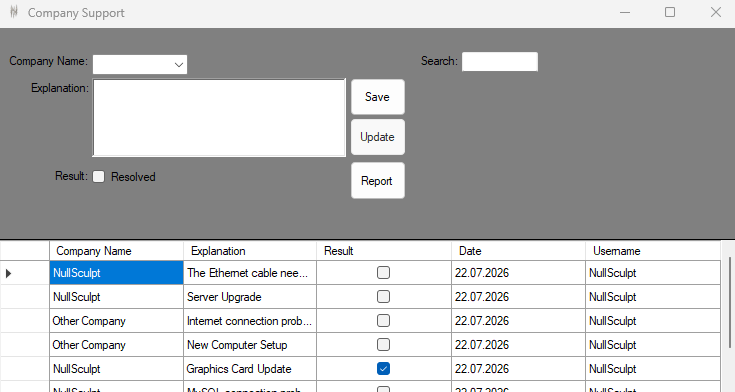
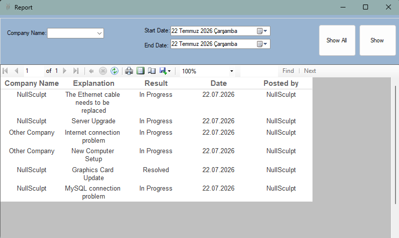

# Company Support Tracker

A Windows Forms (C#) desktop application for tracking and managing company support requests. Built with a simple login system, full CRUD operations, search/filtering, and a reporting module powered by Microsoft ReportViewer.

## Features

- **Login system** — username/password authentication against a SQL database.
- **Create / Read / Update** company support records (companyname, explanation, result status, date, username).
  - *Delete is intentionally not implemented* — records are preserved for audit/history purposes.
- **Live search** — filter records by company name as you type.
- **Reporting module** — filter records by company name and date range, view results in an embedded RDLC report (ReportViewer).
- Parameterized SQL queries throughout to prevent SQL injection.

## Tech Stack

- C# / .NET (Windows Forms)
- SQL Server
- Microsoft ReportViewer (RDLC reports)

## Screenshots

**Login**



**Main Menu**



**Report**



## Getting Started

### Prerequisites
- Visual Studio 2022 (or later)
- Access to a SQL Server instance

### Setup
1. Clone the repository:
   ```
   git clone https://github.com/<NullSculpt/CompanySupportTracker.git
   ```
2. Open the solution (`.sln`) in Visual Studio.
3. Run the SQL script in `/database/schema.sql` against your SQL Server instance to create the `CompanySupport` database and its tables.
4. Update the connection string in `DatabaseConnection.cs` with your SQL Server instance name.
5. Build and run the project.

## Database Schema

**tbl_Company**
| Column | Type | Notes |
|---|---|---|
| id | int (PK, identity) | |
| companyname | nvarchar(50) | |
| explanation | nvarchar(300) | |
| result | bit | true = resolved, false = in progress |
| date | date | |
| username | nvarchar(50) | user who created/last updated the record |

**tbl_login**
| Column | Type | Notes |
|---|---|---|
| username | nvarchar(50) | |
| password | nvarchar(50) | ⚠️ currently stored as plain text (see Roadmap) |

## Project Structure

| File | Purpose |
|---|---|
| `Login.cs` | Login form, authenticates against `tbl_login` |
| `MainMenu.cs` | Main CRUD form for company support records |
| `Report.cs` | Filtered reporting view (RDLC + ReportViewer) |
| `DatabaseConnection.cs` | Centralized SQL connection handling |

## Known Limitations / Roadmap

- No password hashing yet (passwords currently stored/compared as plain text) — planned improvement.
- No layered architecture (Repository/DAL pattern) yet — SQL logic currently lives in the form classes.
- Delete functionality is a deliberate omission, not a missing feature.

## License

This project is for educational/portfolio purposes. Feel free to fork and adapt.

---

# Company Support Tracker (Türkçe)

Şirket destek taleplerini takip etmek ve yönetmek için geliştirilmiş bir Windows Forms (C#) masaüstü uygulaması. Basit bir giriş sistemi, tam CRUD işlemleri, arama/filtreleme ve Microsoft ReportViewer ile çalışan bir raporlama modülü içerir.

## Özellikler

- **Giriş sistemi** — SQL veritabanına karşı kullanıcı adı/şifre doğrulaması.
- **Ekleme / Listeleme / Güncelleme** — şirket destek kayıtları (şirket adı, açıklama, sonuç durumu, tarih, kullanıcı adı).
  - *Silme işlevi bilinçli olarak eklenmemiştir* — kayıtların denetim/geçmiş amacıyla korunması istenmiştir.
- **Canlı arama** — yazarken şirket adına göre kayıtları filtreler.
- **Raporlama modülü** — şirket adı ve tarih aralığına göre filtreleme, sonuçları gömülü bir RDLC raporunda (ReportViewer) görüntüleme.
- SQL injection'a karşı baştan sona parametreli sorgular kullanılmıştır.

## Kullanılan Teknolojiler

- C# / .NET (Windows Forms)
- SQL Server
- Microsoft ReportViewer (RDLC raporları)

## Ekran Görüntüleri

**Giriş Ekranı**


**Ana Menü**


**Rapor**


## Kurulum

### Gereksinimler
- Visual Studio 2022 (veya üzeri)
- Bir SQL Server instance'ına erişim

### Adımlar
1. Depoyu klonla:
   ```
   git clone https://github.com/NullSculpt/CompanySupportTracker.git
   ```
2. Çözüm (`.sln`) dosyasını Visual Studio'da aç.
3. `/database/schema.sql` içindeki SQL script'ini SQL Server instance'ında çalıştırarak `CompanySupport` veritabanını ve tablolarını oluştur.
4. `DatabaseConnection.cs` içindeki connection string'i kendi SQL Server instance adınla güncelle.
5. Projeyi derle ve çalıştır.

## Veritabanı Şeması

**tbl_Company**
| Kolon | Tip | Not |
|---|---|---|
| id | int (PK, identity) | |
| companyname | nvarchar(50) | |
| explanation | nvarchar(300) | |
| result | bit | true = çözüldü, false = devam ediyor |
| date | date | |
| username | nvarchar(50) | kaydı oluşturan/son güncelleyen kullanıcı |

**tbl_login**
| Kolon | Tip | Not |
|---|---|---|
| username | nvarchar(50) | |
| password | nvarchar(50) | ⚠️ şu an düz metin olarak saklanıyor (bkz. Yol Haritası) |

## Proje Yapısı

| Dosya | Amacı |
|---|---|
| `Login.cs` | Giriş formu, `tbl_login`'e karşı doğrulama yapar |
| `MainMenu.cs` | Şirket destek kayıtları için ana CRUD formu |
| `Report.cs` | Filtrelenmiş raporlama görünümü (RDLC + ReportViewer) |
| `DatabaseConnection.cs` | Merkezi SQL bağlantı yönetimi |

## Bilinen Kısıtlamalar / Yol Haritası

- Şifre hash'leme henüz yok (şifreler şu an düz metin olarak saklanıp karşılaştırılıyor) — planlanan bir iyileştirme.
- Katmanlı mimari (Repository/DAL pattern) henüz yok — SQL kodu şu an form sınıflarının içinde.
- Silme (Delete) özelliği bilinçli olarak eklenmemiştir, eksiklik değildir.

## Lisans

Bu proje eğitim/portföy amaçlıdır.
